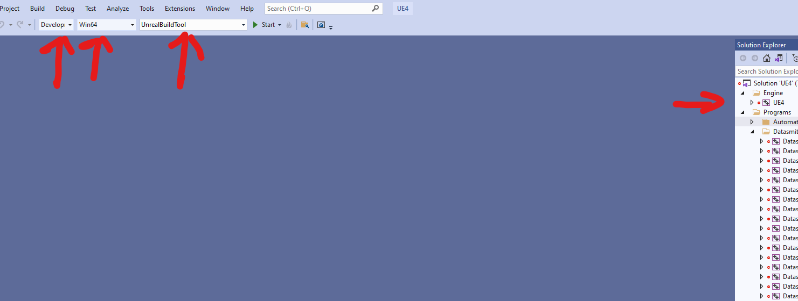
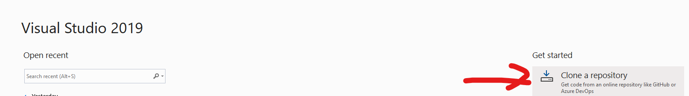
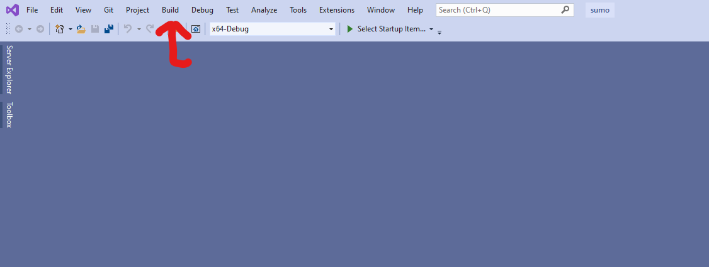

# CARLA Environment Setup
This repository serves to assist those who want to try out CARLA in a Windows environment.

## Minimum Requirements
* Windows 10/11
* NVIDIA GPU: 6 GB minimum (recommended: 8 GB)
* Storage: 200 GB

Better computer specifications would lead to better performance. This requires the ability to install apps including Python, WSL (Ubuntu), and set environmental pathes for programs.

## Installing CARLA
The documentation for CARLA can be found here: https://carla.readthedocs.io/en/latest/ \
A majority of this will be copied from there. There are three versions you might need to keep in mind, CARLA 0.9.15, 0.9.14, and 0.9.13

### Package Installation
For windows, the method for package installing involves installing the zip file and extracting it. The CARLA files can be installed here: 
https://github.com/carla-simulator/carla/blob/master/Docs/download.md \
Once extracted, you can run the CARLA server via the executable file in the folder.

### Source Installation
This is a bit more complicated, longer, and requires more permissions to setup. The source build gives more features including controlling the port, plugins such as Twin Tools, among other capabilities. \
This also involves a number of other software. For a fuller picture, please see CARLA documentation: https://carla.readthedocs.io/en/latest/build_windows/
* [CMAKE](https://cmake.org/download/)
* [Make](https://gnuwin32.sourceforge.net/downlinks/make.php)
* [Git](https://git-scm.com/downloads)
* [7Zip](https://www.7-zip.org/)
* [Python3](https://www.python.org/downloads/) (3.10.12 may need to be installed but its kinda messed up and the tar file doesn't work for some reason) 

Some of these might need to be added to the path if they aren't automatically, please see below for instructions from adding Unreal Engine to the path

With Python comes pip installation, ensure you have a pip version compatible with the CARLA version you are install but by the very least it must be 20.3 
```
pip3 -V # Checks pip version
pip3 install --upgrade pip # Updates pip
```
The following Python libraries need to be installed via pip for CARLA
```
pip3 install --user setuptools
pip3 install --user wheel
```

Visual Studio 2019 needs to be installed. It can be found here: https://visualstudio.microsoft.com/vs/older-downloads/ and following Microsoft's instructions.

Visual Studio needs to be installed with the following modules: 
* Windows SDK (Just take all of the Windows 10 and 11)
* x64 Visual C++ Toolset (w/ Desktop Development with C++)
* .NET Framework 4.6.2 (Inside .NET Desktop Development)


Clone Unreal Engine in a terminal using (Terminal can be opened by typing terminal in the Windows search bar)
``` 
git clone --depth 1 -b carla https://github.com/CarlaUnreal/UnrealEngine.git
```
Configure the repository using
```
Setup.bat
GenerateProjectFiles.bat
```
Then open the UE4.sln in the folder using Visual Studio 2019. <br/>
Ensure the bar on the top is set on Development Editor, Win64, and UnrealBuildTool, then build the solution in the solution explorer located on the right side. Right click UE4 and select build.


Unreal Engine needs to be set as an environmental variable so do so by typing "Edit the System Environmental Variables" into the windows search bar, click environmental variables and add it as UE4_ROOT with the path or location of the Unreal Engine installation to the variable. You can get the path easily by clicking the folder in the top of the Windows folder and selecting Copy Address as path


Next clone the CARLA repository with
```
git clone https://github.com/carla-simulator/carla
Update.bat
```
This will download the latest CARLA version build <br/>
CARLA can then be built with the following
```
make PythonAPI
```
and run with
```
make launch
```
This launches the CARLA server

## Running CARLA Client
I highly recommend setting up a virtual environment via venv or anaconda however that is not required.\

Some issues my appear from the egg file not appear from make PythonAPI. If the egg file, located in CARLAROOT/PythonAPI/carla/dist does not appear. If this happens, try making again. Otherwise you can force an install with the wheel installation as shown in CARLA documentation
```
pip3 install <path/to/wheel>.whl
```
The files should look something similar to 
```
carla-0.9.15-py3.7-win-amd64.egg
carla-0.9.15-cp37-cp37m-win_amd64.whl
```
Once done, you can connect to the server using some of the example scripts found in CARLAROOT/PythonAPI/examples such as
```
pip3 install -r requirements.txt
python3 generate_traffic.py  
```

## Installing SUMO

I highly recommend installing SUMO through the MSI Installer instead of the source. The installer can be found [here](https://sumo.dlr.de/docs/Downloads.php)

### Source Installer

The instructions from SUMO for the source installation can be found [here](https://sumo.dlr.de/docs/Installing/Windows_Build.html) <br/>
However, the instructions are a bit lacking with a few Visual Studio modules not being specifically mentioned.

The Visual Studio Community installer will need to be modified with a few more modules before it can be used to build SUMO. For Python Development, you will probably need Python native development tools, miniconda, web support, and Live Share. Since you already have Python, you won't need to install Python through the Visual Studio Installer. For Desktop Development with C++, I recommend clicking everything except for Incredibuild.

Clone the SUMO Repository
```
git clone --recursive https://github.com/eclipse-sumo/sumo
```
Then, using Visual Studio, clone the SUMOLibraries repository.

```
https://github.com/DLR-TS/SUMOLibraries
```

Set the SUMO Libraries into the environment as a SUMO_LIBRARIES environmental variable using the same steps for UE4_ROOT. I also highly recommend setting SUMOLibaries\fox-1.6.57, SUMOLibaries\proj-9.0.0, and SUMOLibaries\xerces-c-3.2.4 to the path.

Visual Studio will start configuring the repository. Once that is done, open the SUMO repository (that you cloned with git) with Visual Studio and Build All


Then set the folder as the SUMO_HOME environmental variable. 

Install Texttest using the following [link](https://sourceforge.net/projects/texttest/files/latest/download)

Ensure that in the terminal you are using to run SUMO, you install the requirements located in the tools folder of SUMO
```
pip install -r tools\requirements.txt -r tools\req_dev.txt
```

## Running SUMO With CARLA
CARLA has built in example Co-simulation scripts with a few of the example maps.

Once you change the map to the example you want to use, in the [CARLA docs](https://carla.readthedocs.io/en/0.9.15/adv_sumo/) they use Town04, 
```
cd PythonAPI/util
python3 config.py --map Town04
```

You can run the co-simulation script for the town
```
cd ~/carla/Co-Simulation/Sumo
python3 run_synchronization.py examples/Town04.sumocfg  --sumo-gui
```
Which will open SUMO and have it connect with CARLA. <br/>

SUMO can also be opened without using CARLA either by opening the exe file found in the sumo/bin or typing sumo-gui in terminal. If you build the source, you also get OSMWebWizard located in tools. There also other programs such as netconvert and netedit in the bin.


## Autoware
Autoware is not natively usable in Windows requiring at the very least Docker but most likely also WSL2. WSL2 creates a virtual Linux environment (which Autoware utilizes) and Docker enables modular design and contains the program within a specific environment.

### WSL + Docker Setup

WSL2 is extremely easy to install with either by downloading Ubuntu from the Microsoft store for free or typing into a terminal with admin privileges
```
wsl --install
```

Docker Desktop can be downloaded [here](https://www.docker.com/products/docker-desktop/)

Please make sure to enable WSL Integration in Docker Desktop for Ubuntu

Due to Autoware using NVIDIA, make sure you download your NVIDIA driver either [here](https://www.nvidia.com/download/index.aspx) or through [GeForce Experience](https://www.nvidia.com/en-us/geforce/geforce-experience/download/)

Then download CUDA [here](https://developer.nvidia.com/cuda-downloads?target_os=Linux)

This enables Docker to utilize your NVIDIA GPU properly.

[RAPIDS](https://docs.rapids.ai/notices/rgn0024/), and [NCCL](https://docs.nvidia.com/deeplearning/nccl/install-guide/index.html#down) also need to be installed in WSL

For additional intructions, see [here](https://docs.nvidia.com/cuda/wsl-user-guide/index.html#getting-started-with-cuda-on-wsl)

Once that is done, you need to install the CARLA client via a tar file. This is the quick installation and not the source. You can download the tar.gz file from [here](https://github.com/carla-simulator/carla/blob/master/Docs/download.md) and move it to your Ubuntu in your folder or type the following in WSL
```
wget https://tiny.carla.org/carla-0-9-15-linux
```
You can replace the link with the correct version of CARLA you want to install.

Once done, you can then extract the tar file with the following
```
tar -xvzf file.tar.gz
```
You then have the CARLA client installed in WSL. You can try testing this with your CARLA server on Windows. However, remember that they are considered separate devices so you will need to lower the Firewall on Windows to allow WSL to pass through as well as connect to the ip of the Windows computer. This can be found by typing in the terminal
```
ipconfig
```
and looking for the IPV4 address.

### CARLA Autoware

For the Autoware CARLA bridge, I used [CY's repository](https://github.com/evshary/autoware_carla_launch/tree/humble) as a starting point. There are others out there but this one is modulated for Autoware, the bridge, and allows multiple Autoware-controlled vehicles to act in CARLA.

Please follow their instructions and I used the humble branch. However, some of the links in the code have been depreciated so I have modified the Dockerfiles to use the newer repositories that host Autoware. 
```
FROM ghcr.io/autowarefoundation/autoware:humble-2023.08-prebuilt-cuda-amd64
```
This needs to be changed as Autoware used to be hosted in a repository called Autoware-universe which no longers exist.
